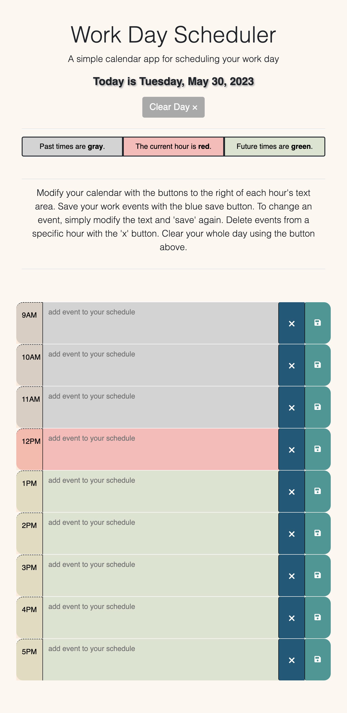

# Module 5 Challenge - Work Day Scheduler

## Description

The motivation for creating this project was to produce a simple scheduler for a standard work day. The planner should display the current day, as well as the hours (9am-5pm) for that day, color-coded to show you past, present, and future times. I built this to get more familiar with Dayjs, Bootstrap, and JavaScript in general.  
  
The use of Local Storage allows the scheduled events to persist throughout the day. Events are saved to local storage based on their time (the 'id' of that time block), and are kept there until the user clears that event or the whole day (see Features for additional clearing features added).  

I learned different ways to display current times and days using Dayjs, as well as how to create a clean design using Bootstrap.  

## User Story  

AS AN employee with a busy schedule  
I WANT to add important events to a daily planner  
SO THAT I can manage my time effectively  

## Acceptance Criteria

GIVEN I am using a daily planner to create a schedule  
WHEN I open the planner  
THEN the current day is displayed at the top of the calendar  
WHEN I scroll down  
THEN I am presented with time blocks for standard business hours  
WHEN I view the time blocks for that day  
THEN each time block is color-coded to indicate whether it is in the past, present, or future  
WHEN I click into a time block  
THEN I can enter an event  
WHEN I click the save button for that time block  
THEN the text for that event is saved in local storage  
WHEN I refresh the page  
THEN the saved events persist  

## Usage

You can find the published GitHub page for this project at: https://randirose.github.io/week-5-challenge

    

## Features

- In addition